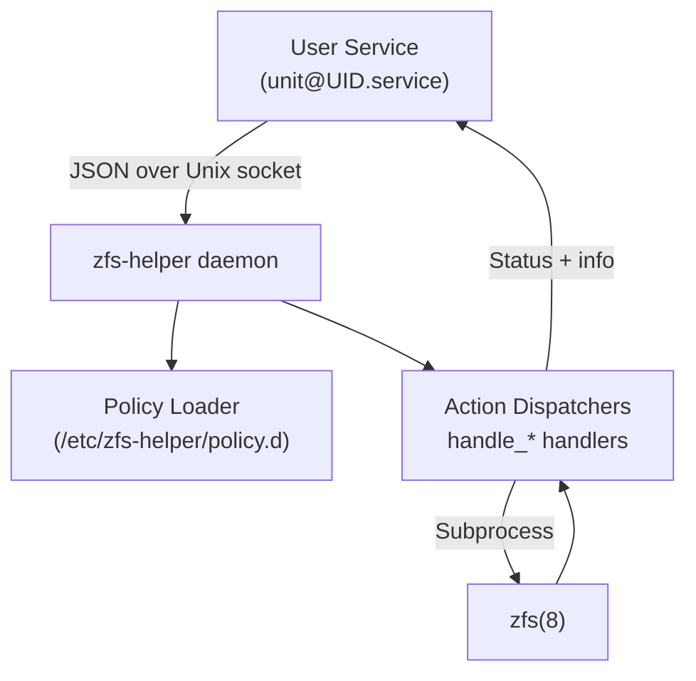
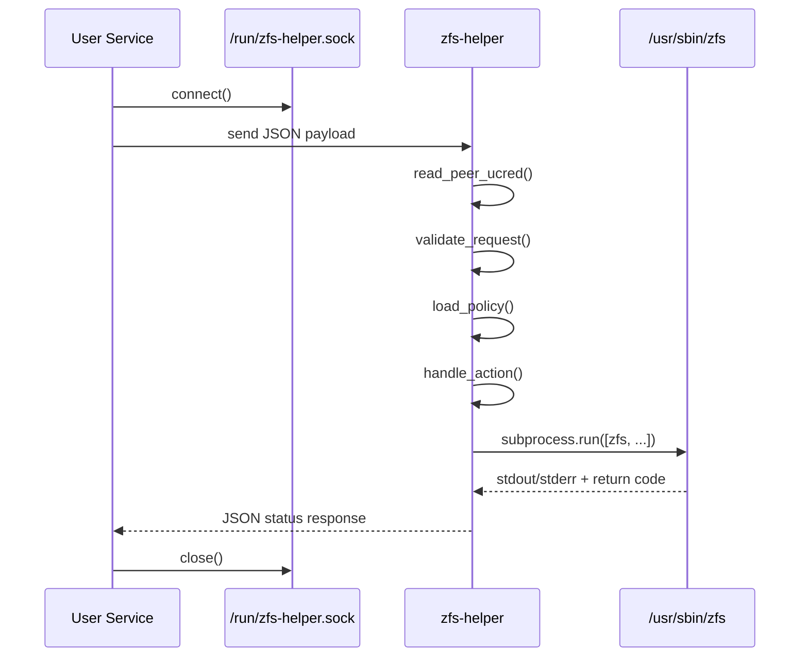

# zfs-helper Design

## Summary
- `zfs-helper` is a privileged UNIX-domain socket daemon that executes a constrained set of `zfs(8)` operations on behalf of unprivileged systemd user services.
- Access is governed by per-user policy files stored under `/etc/zfs-helper/policy.d/<user>/`, allowing fine-grained control over datasets, snapshots, and property mutations.
- Requests are expressed as single-line JSON payloads; responses echo a JSON object containing a status code and informational string.

## High-Level Architecture

## Request Lifecycle

## Detailed Behavior
- **Socket management:** The daemon prefers a systemd-provided socket via `LISTEN_FDS`; otherwise it binds `/run/zfs-helper.sock`, enforces `0660` permissions, and attempts to chown the path to the `zfshelper` group.
- **Credential verification:** `SO_PEERCRED` supplies `(pid, uid, gid)`. The peer must belong to a systemd user service (`user@UID.service/app.slice/…`) that matches at least one glob in `units.list`.
- **Group membership:** Callers must be members of the `zfshelper` POSIX group; non-members receive `DENY_GROUP`.
- **Per-user dataset checks:** Every dataset-policy line binds a dataset glob to an authorized username; requests from other users are denied even if the glob matches.
- **Policy lookup:** Policy files are optional, newline-delimited allow-lists. Empty or missing files imply denial except when fallbacks exist (e.g., `unmount` falls back to `mount` allow-list).
- **Request validation:** Payloads must be JSON with an `action` field. Root callers are rejected. Maximum payload size is capped at 8 KiB.
- **Action dispatch:** Supported actions map to dedicated handlers (`handle_mount`, `handle_snapshot`, etc.) that validate arguments using regexes, check policy globs, then invoke `zfs_ok`.
- **Command execution:** `zfs_ok` wraps `subprocess.run`, collecting stdout/stderr. Results are normalized into `(status, info)` pairs where success yields `"OK"` and failures translate into `"ERROR"` or `"DENY_*"` codes.
- **Ownership harmonization:** Successful dataset creates and renames trigger a recursive chown of the dataset tree to the caller’s UID and primary GID. Snapshot creates chown the corresponding `.zfs/snapshot/<name>` directories (recursively when `-r` is used).
- **Logging:** All decisions flow through `log()`, emitting single-line structured records tagged by `LOG_TAG`.

## Policy Files
- `units.list`: Allowed systemd unit globs.
- `mount.list`, `unmount.list`, `snapshot.list`, `rollback.list`, `create.list`, `destroy.list`, `share.list`: One entry per line in the form `<user> <dataset-glob>`.
- `rename.from.list`, `rename.to.list`: `<user> <dataset-glob>` entries for rename sources and destinations.
- `setprop.list`: `<user> <dataset-glob>` entries eligible for property updates.
- For all dataset policy files a wildcard username of `*` grants access to any member of the `zfshelper` group; omit or mismatch the username to deny.
- `setprop.values.list`: Property key/value or mountpoint glob rules (`key=value` or `key:glob`). A blank ruleset falls back to builtin safety checks for `canmount`, `mountpoint`, and `sharenfs`.
- Dataset globs use gitignore-style matching: `*` stays within a single path segment, `?` matches a single character, and `**` spans arbitrarily many segments.

## Delegation Sync Script
- `sbin/apply-delegation.py` ingests the policy tree and issues `zfs allow`/`unallow` calls so OpenZFS delegation matches the helper’s view of who may run which operations.
- Managed permissions include `mount`, `snapshot`, `rollback`, `create`, `destroy`, `rename`, `share` (where supported), and property grants (`property=mountpoint`, `property=canmount`, `property=sharenfs`).
- Invoke it with `--dry-run` to preview, then without for enforcement. Commands that OpenZFS refuses to delegate log warnings but do not abort the run.

## Supported Actions
- `mount`, `unmount`, `share`
- `snapshot`, `rollback`, `destroy`
- `create`, `rename`
- `setprop` (restricted to `mountpoint`, `canmount`, `sharenfs`)

Each handler sanitizes input using strict regexes (`DATASET_RE`, `SNAP_RE`) before deferring to `zfs(8)`.

## Failure Handling
- Policy or validation failures immediately respond with `DENY_*` or `BAD_*` codes without invoking `zfs`.
- Runtime errors while servicing connections generate `"ERROR"` responses and get logged with truncated info payloads.
- The main accept loop tolerates transient exceptions (sleeping 50 ms) and exits cleanly on `KeyboardInterrupt`.

## Deployment Notes
- Systemd socket activation is supported by inheriting file descriptor 3 when `LISTEN_FDS=1`.
- Without socket activation, ensure the daemon can create `/run/zfs-helper.sock` and that the `zfshelper` group contains trusted user services.
- Policies are hot-loaded per request; updates to files take effect on the next action without restarting the daemon.
