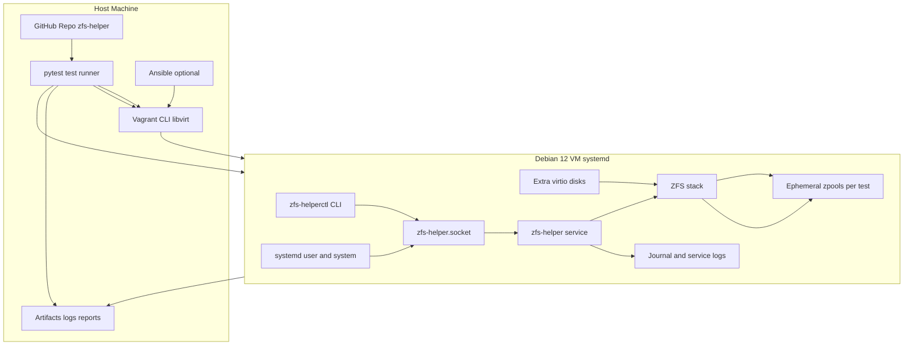
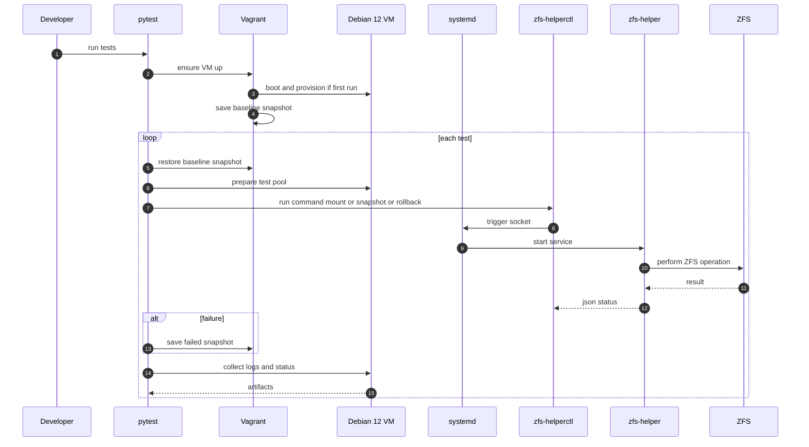

# Testing

This document describes the architecture and operation of the automated test harness for `zfs-helper`, which uses `pytest` to run integration tests against a Debian 12 VM provisioned via Vagrant and libvirt. Each test executes ZFS operations through the helper in an isolated ephemeral zpool, verifying correct behavior, policy enforcement, ownership, and logging.

After all what makes this system valuable is not just the little snippets of code here and there but the tests and real life use that ensure its correctness and security. The following sections outline the architecture and lifecycle of the test harness.

## Harness Architecture

## Per-Test Lifecycle

## Test Coverage

- Unit tests cover policy parsing, glob matching, request validation, and action handlers.
- Integration tests exercise end-to-end request flows for all supported actions (`mount`, `unmount`, `snapshot`, `rollback`, `create`, `destroy`, `rename`, `setprop`, `share`).
- Negative tests verify denial cases: unauthorized units, disallowed datasets, invalid arguments, root callers, malformed payloads.
- Ownership tests confirm that created datasets and snapshots have correct UID/GID ownership.
- Logging tests ensure that all decisions are logged with appropriate structured data.
- Delegation sync tests validate that `apply-delegation.py` correctly reflects policy in ZFS delegation settings.
