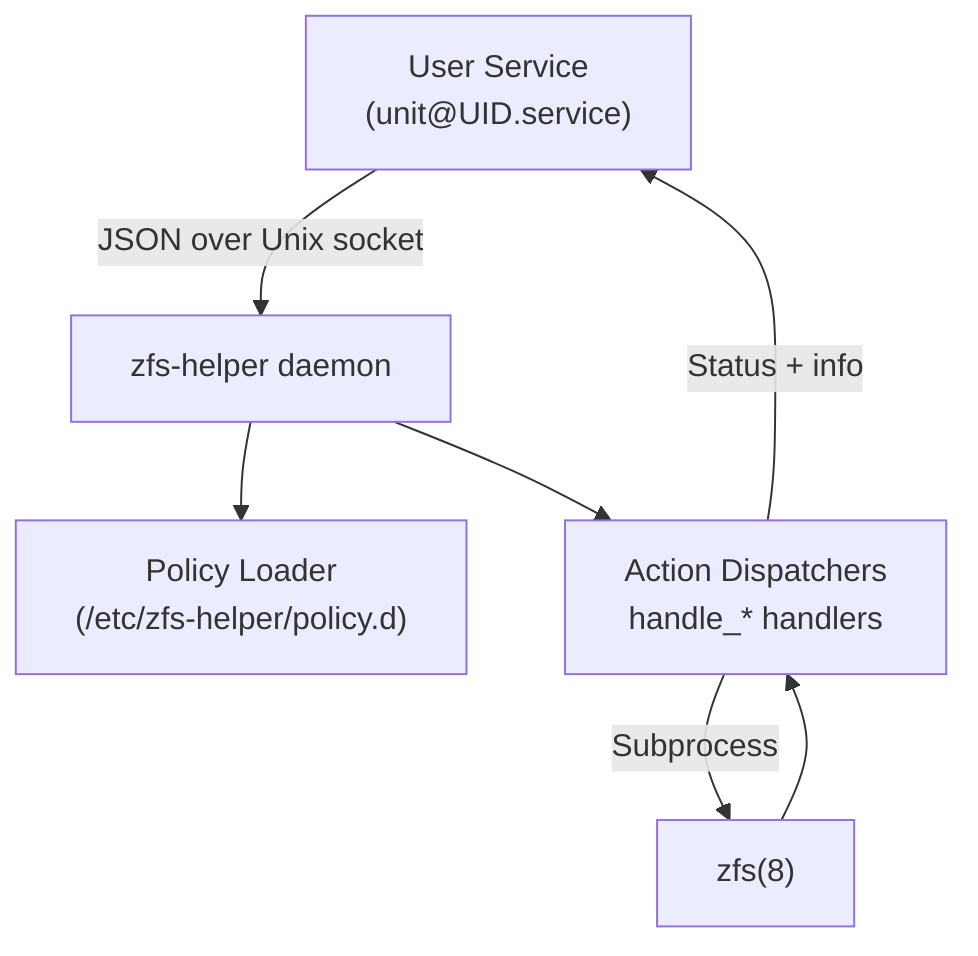
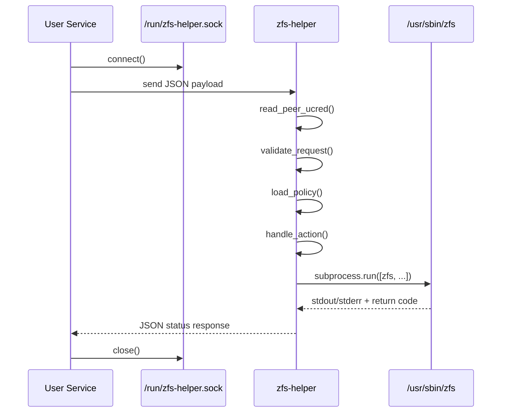

# Architecture & Design

ZFS Helper implements a secure privilege delegation architecture that bridges the gap between unprivileged user services and privileged ZFS operations.

## Summary

`zfs-helper` is a privileged UNIX-domain socket daemon that executes a constrained set of `zfs(8)` operations on behalf of unprivileged systemd user services. Access is governed by per-user policy files stored under `/etc/zfs-helper/policy.d/<user>/`, allowing fine-grained control over datasets, snapshots, and property mutations. Requests are expressed as single-line JSON payloads; responses echo a JSON object containing a status code and informational string.

## High-Level Architecture



## System Overview

```
┌─────────────────────────────────────────────────────────────────┐
│                    User Space (Unprivileged)                    │
├─────────────────────────────────────────────────────────────────┤
│  ┌─────────────────┐    ┌──────────────────────────────────────┐ │
│  │ User Services   │    │ User Applications                    │ │
│  │ - backup@.srv   │    │ - Container engines                  │ │
│  │ - container@.srv│    │ - Backup scripts                     │ │
│  │ - dev-env.srv   │    │ - Development tools                  │ │
│  └─────────────────┘    └──────────────────────────────────────┘ │
│           │                               │                      │
│           └───────────────┬───────────────┘                      │
│                           │                                      │
│                  ┌────────▼────────┐                             │
│                  │ zfs-helperctl   │                             │
│                  │ (Client Tool)   │                             │
│                  └────────┬────────┘                             │
├───────────────────────────┼─────────────────────────────────────┤
│                           │                                      │
│              ┌────────────▼────────────┐                         │
│              │    UNIX Socket          │                         │
│              │ /run/zfs-helper.sock    │                         │
│              │   (root:zfshelper)      │                         │
│              └────────────┬────────────┘                         │
├───────────────────────────┼─────────────────────────────────────┤
│                    Root Space (Privileged)                      │
├───────────────────────────┼─────────────────────────────────────┤
│              ┌────────────▼────────────┐                         │
│              │   zfs-helper.py         │                         │
│              │   (Daemon)              │                         │
│              │                         │                         │
│              │ ┌─────────────────────┐ │                         │
│              │ │ Policy Engine       │ │                         │
│              │ │ - User validation   │ │                         │
│              │ │ - Service validation│ │                         │
│              │ │ - Dataset validation│ │                         │
│              │ └─────────────────────┘ │                         │
│              │                         │                         │
│              │ ┌─────────────────────┐ │                         │
│              │ │ ZFS Interface       │ │                         │
│              │ │ - Command execution │ │                         │
│              │ │ - Error handling    │ │                         │
│              │ │ - Ownership mgmt    │ │                         │
│              │ └─────────────────────┘ │                         │
│              └────────────┬────────────┘                         │
│                           │                                      │
│                  ┌────────▼────────┐                             │
│                  │   ZFS Kernel    │                             │
│                  │   Module        │                             │
│                  └─────────────────┘                             │
└─────────────────────────────────────────────────────────────────┘
```

## Request Lifecycle



## Core Components

### 1. Client Tool (`zfs-helperctl`)

**Purpose**: User-space interface for requesting ZFS operations
**Language**: Bash script
**Location**: `/usr/bin/zfs-helperctl`

**Responsibilities**:
- Command-line argument parsing and validation
- JSON payload construction
- UNIX socket communication with daemon
- Error reporting and status codes

**Security Features**:
- No privileged operations
- Input validation and sanitization
- Secure socket communication

### 2. Privileged Daemon (`zfs-helper.py`)

**Purpose**: Privileged service that executes authorized ZFS operations
**Language**: Python 3
**Location**: `/usr/sbin/zfs-helper.py`

**Architecture**:
```python
┌─────────────────────────────────────────────────────────────┐
│                    zfs-helper.py                            │
├─────────────────────────────────────────────────────────────┤
│ ┌─────────────────┐  ┌─────────────────┐  ┌───────────────┐ │
│ │ Socket Handler  │  │ Auth Engine     │  │ ZFS Executor  │ │
│ │ - Accept conns  │  │ - SO_PEERCRED   │  │ - Command run │ │
│ │ - Parse JSON    │  │ - Cgroup check  │  │ - Output parse│ │
│ │ - Validate msgs │  │ - Policy lookup │  │ - Error handle│ │
│ └─────────────────┘  └─────────────────┘  └───────────────┘ │
│          │                     │                    │       │
│          └─────────┬───────────┼────────────────────┘       │
│                    │           │                            │
│ ┌─────────────────────────────────────────────────────────┐ │
│ │              Logging & Audit Engine                     │ │
│ │ - Structured JSON logs                                  │ │
│ │ - ALLOW/DENY/ERROR decisions                            │ │
│ │ - Performance metrics                                   │ │
│ └─────────────────────────────────────────────────────────┘ │
└─────────────────────────────────────────────────────────────┘
```

## Detailed Behavior

### Socket Management
The daemon prefers a systemd-provided socket via `LISTEN_FDS`; otherwise it binds `/run/zfs-helper.sock`, enforces `0660` permissions, and attempts to chown the path to the `zfshelper` group.

### Credential Verification
`SO_PEERCRED` supplies `(pid, uid, gid)`. The peer must belong to a systemd user service (`user@UID.service/app.slice/…`) that matches at least one glob in `units.list`.

### Group Membership
Callers must be members of the `zfshelper` POSIX group; non-members receive `DENY_GROUP`.

### Per-User Dataset Checks
Every dataset-policy line binds a dataset glob to an authorized username; requests from other users are denied even if the glob matches.

### Policy Lookup
Policy files are optional, newline-delimited allow-lists. Empty or missing files imply denial except when fallbacks exist (e.g., `unmount` falls back to `mount` allow-list).

### Request Validation
Payloads must be JSON with an `action` field. Root callers are rejected. Maximum payload size is capped at 8 KiB.

### Action Dispatch
Supported actions map to dedicated handlers (`handle_mount`, `handle_snapshot`, etc.) that validate arguments using regexes, check policy globs, then invoke `zfs_ok`.

### Command Execution
`zfs_ok` wraps `subprocess.run`, collecting stdout/stderr. Results are normalized into `(status, info)` pairs where success yields `"OK"` and failures translate into `"ERROR"` or `"DENY_*"` codes.

### Ownership Harmonization
Successful dataset creates and renames trigger a recursive chown of the dataset tree to the caller's UID and primary GID. Snapshot creates chown the corresponding `.zfs/snapshot/<name>` directories (recursively when `-r` is used).

### Logging
All decisions flow through `log()`, emitting single-line structured records tagged by `LOG_TAG`.

## Supported Actions

Each handler sanitizes input using strict regexes (`DATASET_RE`, `SNAP_RE`) before deferring to `zfs(8)`:

- **`mount`, `unmount`, `share`** - Dataset mounting and sharing operations
- **`snapshot`, `rollback`, `destroy`** - Snapshot lifecycle management
- **`create`, `rename`** - Dataset creation and renaming
- **`setprop`** - Property setting (restricted to `mountpoint`, `canmount`, `sharenfs`)

## Policy Files Structure

Policy files control access at multiple levels:

### Service Authorization
- **`units.list`**: Allowed systemd unit globs

### Dataset Operations
Per-operation files with `<user> <dataset-glob>` entries:
- **`mount.list`, `unmount.list`**: Mount/unmount permissions
- **`snapshot.list`, `rollback.list`**: Snapshot operations
- **`create.list`, `destroy.list`**: Dataset lifecycle
- **`share.list`**: Dataset sharing
- **`rename.from.list`, `rename.to.list`**: Rename sources and destinations
- **`setprop.list`**: Property modification targets

### Property Constraints
- **`setprop.values.list`**: Property key/value or mountpoint glob rules (`key=value` or `key:glob`)

**Notes**:
- Wildcard username `*` grants access to any `zfshelper` group member
- Dataset globs use gitignore-style matching: `*` within segments, `**` across segments, `?` for single characters
- Blank `setprop.values.list` falls back to builtin safety checks

## Security Architecture

### Multi-Layer Authorization

1. **Network Layer**: UNIX socket with group ownership
2. **Kernel Layer**: SO_PEERCRED for authentic PID/UID/GID
3. **Process Layer**: Systemd user service validation via cgroups
4. **Application Layer**: Policy-based authorization
5. **Audit Layer**: Comprehensive logging of all decisions

### Trust Boundaries

```
┌─────────────────┐    Trust    ┌─────────────────┐
│   User Space    │─ Boundary ─│   Root Space    │
│                 │      ↓      │                 │
│ - User services │     UNIX    │ - zfs-helper    │
│ - zfs-helperctl │    Socket   │ - Policy files  │
│ - Client tools  │             │ - ZFS commands  │
└─────────────────┘             └─────────────────┘
```

**Trust Model**:
- User space is **untrusted**
- Socket provides **authenticated communication**
- Root space validates **all requests**
- Policy files define **authorized operations**
- ZFS kernel module is **final arbiter**

### Privilege Escalation Prevention

1. **Minimal Capabilities**: Only `CAP_SYS_ADMIN` and `CAP_DAC_READ_SEARCH`
2. **Syscall Filtering**: Restricted to essential syscalls only
3. **Filesystem Protection**: Most of filesystem is read-only
4. **Process Isolation**: Private /tmp, /dev restrictions
5. **No New Privileges**: Prevents privilege escalation

## Data Flow

### Request Processing

```
┌─────────────┐    JSON     ┌─────────────┐    Validation    ┌─────────────┐
│zfs-helperctl│────────────▶│zfs-helper.py│─────────────────▶│Policy Engine│
└─────────────┘             └─────────────┘                  └─────────────┘
                                    │                               │
                            ┌───────▼──────┐               ┌───────▼──────┐
                            │   ZFS CMD    │               │    ALLOW/    │
                            │  Execution   │◀──────────────│     DENY     │
                            └───────┬──────┘               └──────────────┘
                                    │
                            ┌───────▼──────┐
                            │   Response   │
                            │  & Logging   │
                            └──────────────┘
```

### Example Request Flow

1. **User Service**: `systemctl --user start backup@pre-upgrade`
2. **Client Call**: `zfs-helperctl snapshot tank/home/alice@pre-upgrade`
3. **JSON Message**: `{"action":"snapshot","target":"tank/home/alice@pre-upgrade"}`
4. **Daemon Receives**: Extracts PID/UID/GID via SO_PEERCRED
5. **Authorization**: Checks cgroups, group membership, policy files
6. **Execution**: `/usr/sbin/zfs snapshot tank/home/alice@pre-upgrade`
7. **Response**: Success/failure back to client
8. **Logging**: Structured audit log with decision rationale

## Error Handling

### Client-Side Errors
- **Usage errors**: Invalid arguments, missing parameters
- **Connection errors**: Socket unavailable, permission denied
- **Communication errors**: Malformed responses, timeouts

### Server-Side Errors
- **Authentication errors**: Invalid credentials, group membership
- **Authorization errors**: Policy violations, unauthorized operations
- **Execution errors**: ZFS command failures, system errors

### Logging Strategy

All errors are logged with structured JSON containing:
```json
{
  "timestamp": "2025-10-24T12:00:00Z",
  "level": "ERROR",
  "caller_uid": 1000,
  "caller_pid": 12345,
  "service_unit": "backup@pre-upgrade.service",
  "action": "snapshot",
  "target": "tank/home/alice@pre-upgrade",
  "decision": "DENY",
  "reason": "dataset not in snapshot.list",
  "policy_file": "/etc/zfs-helper/policy.d/alice/snapshot.list"
}
```

## Performance Considerations

### Socket Activation
- **Lazy Loading**: Daemon starts only when needed
- **Resource Efficiency**: No continuous background process
- **Fast Startup**: Minimal initialization overhead

### Policy Caching
- **File Watching**: Reload policies on file changes
- **Memory Caching**: Keep parsed policies in memory
- **Glob Compilation**: Pre-compile patterns for performance

### ZFS Command Optimization
- **Direct Execution**: No shell interpretation overhead
- **Minimal Parsing**: Extract only necessary output
- **Error Propagation**: Preserve exit codes and messages

## Scalability

### Concurrent Requests
- **Single-threaded**: Prevents race conditions
- **Request Queuing**: Socket backlog handles bursts
- **Fast Processing**: Sub-millisecond policy decisions

### Multi-User Support
- **Per-User Policies**: Isolated configuration
- **Shared Infrastructure**: Single daemon serves all users
- **Efficient Lookup**: O(1) policy file access

## Delegation Sync Script

`/usr/sbin/apply-delegation.py` ingests the policy tree and issues `zfs allow`/`unallow` calls so OpenZFS delegation matches the helper's view of who may run which operations.

**Managed permissions include**:
- `mount`, `snapshot`, `rollback`, `create`, `destroy`, `rename`, `share` (where supported)
- Property grants (`property=mountpoint`, `property=canmount`, `property=sharenfs`)

**Usage**:
- Invoke with `--dry-run` to preview changes
- Run without flags for enforcement
- Commands that OpenZFS refuses to delegate log warnings but do not abort

## Failure Handling

### Policy and Validation Failures
Policy or validation failures immediately respond with `DENY_*` or `BAD_*` codes without invoking `zfs`.

### Runtime Errors
Runtime errors while servicing connections generate `"ERROR"` responses and get logged with truncated info payloads.

### Connection Handling
The main accept loop tolerates transient exceptions (sleeping 50 ms) and exits cleanly on `KeyboardInterrupt`.

## Deployment Considerations

### Systemd Socket Activation
Systemd socket activation is supported by inheriting file descriptor 3 when `LISTEN_FDS=1`.

### Manual Socket Management
Without socket activation, ensure the daemon can create `/run/zfs-helper.sock` and that the `zfshelper` group contains trusted user services.

### Policy Hot-Loading
Policies are hot-loaded per request; updates to files take effect on the next action without restarting the daemon.

## Performance Considerations

### Socket Activation
- **Lazy Loading**: Daemon starts only when needed
- **Resource Efficiency**: No continuous background process
- **Fast Startup**: Minimal initialization overhead

### Policy Caching
- **File Watching**: Reload policies on file changes
- **Memory Caching**: Keep parsed policies in memory
- **Glob Compilation**: Pre-compile patterns for performance

### ZFS Command Optimization
- **Direct Execution**: No shell interpretation overhead
- **Minimal Parsing**: Extract only necessary output
- **Error Propagation**: Preserve exit codes and messages

## Scalability

### Concurrent Requests
- **Single-threaded**: Prevents race conditions
- **Request Queuing**: Socket backlog handles bursts
- **Fast Processing**: Sub-millisecond policy decisions

### Multi-User Support
- **Per-User Policies**: Isolated configuration
- **Shared Infrastructure**: Single daemon serves all users
- **Efficient Lookup**: O(1) policy file access

## Future Architecture Considerations

### Potential Enhancements
1. **Multi-threaded Processing**: For high-concurrency environments
2. **Policy Caching**: Redis/memory-based policy store
3. **Remote Management**: Web UI for policy administration
4. **Audit Database**: Structured storage for log analysis
5. **Plugin Architecture**: Extensible operation handlers
6. **Performance Metrics**: Prometheus integration
7. **Configuration Management**: Ansible/Puppet modules

### Backwards Compatibility
- **API Versioning**: JSON protocol versioning
- **Policy Migration**: Automatic policy file updates
- **Configuration Compatibility**: Maintain existing file formats