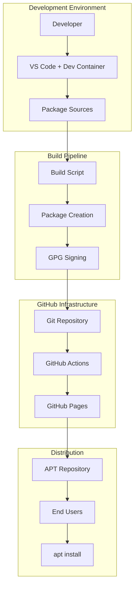
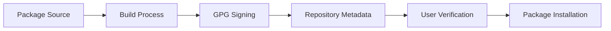

# Design & Architecture

The GH-Repos project provides a complete solution for hosting APT repositories on GitHub Pages with automated package management, signing, and deployment.

## Core Objectives

The aim is simple yet powerful:

- ✅ **Generate** a GitHub Pages website from MkDocs
- ✅ **Publish** an APT repository with proper GPG signatures on the website under `/apt`
- ✅ **Automate** package building, signing, and release processes
- ✅ **Provide** a scalable foundation for multiple repository types

## System Architecture



## Key Components

### 1. Development Container

The project uses a sophisticated Dev Container setup to ensure consistent builds across different environments.

#### Platform Requirements

!!! warning "Linux-Specific Design"
    Highly specific to Linux - some mechanisms are not available on macOS or Windows due to user mapping requirements.

#### User Alignment Strategy

The system dynamically aligns container users with host users to prevent permission issues with bind mounts.

##### Buildtime Configuration

The `devcontainer.json` build args section sets username/uid/gid from shell environment:

```json
{
  "build": {
    "args": {
      "USERNAME": "${localEnv:USER}",
      "USER_UID": "${localEnv:UID}",
      "USER_GID": "${localEnv:GID}"
    }
  }
}
```

!!! danger "Environment Variables Required"
    Make sure all these values are exported in your environment:
    ```bash
    export UID=$(id -u)
    export GID=$(id -g)
    ```
    Otherwise values default to: USERNAME=dev, USER_UID=1000, USER_GID=1000

##### Runtime Adaptation

Runtime properties ensure dynamic user alignment:

```json
{
  "updateRemoteUserUID": true,
  "containerUser": "${localEnv:USER}",
  "remoteUser": "${localEnv:USER}"
}
```

This prevents permission issues even if the container was built with different user settings.

### 2. Package Management

#### Package Structure

Each package follows Debian package conventions:

```
pkgs/
└── package-name/
    ├── DEBIAN/
    │   ├── control          # Package metadata
    │   ├── postinst         # Post-installation script
    │   ├── prerm            # Pre-removal script
    │   └── postrm           # Post-removal script
    ├── usr/                 # File system layout
    │   ├── bin/             # Executables
    │   ├── share/           # Shared data
    │   └── lib/             # Libraries
    └── build.sh             # Build script (optional)
```

#### Build Process

The build pipeline follows these steps:

1. **Source Preparation** - Organize package files
2. **Dependency Resolution** - Handle build dependencies
3. **Compilation** - Build from source if needed
4. **Package Creation** - Generate .deb files
5. **Metadata Generation** - Create APT repository metadata
6. **GPG Signing** - Sign packages and repository

### 3. Security Model

#### GPG Key Management

- **Public Key** - Stored in `keys/apt-repo-pubkey.asc`
- **Private Key** - Kept secure (hardware token recommended)
- **Signing Process** - Automated but secure

#### Trust Chain



### 4. GitHub Pages Integration

#### Repository Structure

```
Repository Root
├── mkdocs/              # Documentation source
├── docs/                # Generated GitHub Pages content
│   ├── index.html       # Website homepage
│   ├── Packages         # APT package list
│   ├── Packages.gz      # Compressed package list
│   ├── Release          # Repository metadata
│   ├── Release.gpg      # GPG signature
│   └── pool/            # Package files (.deb)
└── keys/                # GPG public keys
```

#### Dual Purpose Design

The same repository serves as:

1. **Documentation Website** - Built with MkDocs
2. **APT Repository** - Standard Debian repository structure

### 5. Automation Scripts

#### Build Script (`scripts/build.sh`)
- Compiles packages from source
- Creates .deb files
- Generates repository metadata

#### Signing Script (`scripts/sign.sh`)
- Signs individual packages
- Signs repository metadata
- Manages GPG operations

#### Publishing Script (`scripts/publish.sh`)
- Prepares GitHub Pages content
- Updates repository structure
- Triggers deployment

## Extensibility

### Beyond APT Repositories

The architecture is designed for expansion:

- **RPM Repositories** - Red Hat package format
- **Flatpak Repositories** - Universal Linux packages
- **Snap Repositories** - Ubuntu universal packages
- **Container Registries** - Docker/OCI images

### Plugin Architecture

Future enhancements could include:

- **Build Plugins** - Custom build processes
- **Signing Providers** - Alternative signing methods
- **Distribution Targets** - Multiple hosting platforms
- **Notification Systems** - Build status updates

## Performance Considerations

### Build Optimization

- **Incremental Builds** - Only rebuild changed packages
- **Parallel Processing** - Multi-package builds
- **Caching Strategies** - Dependency and artifact caching

### Distribution Efficiency

- **CDN Integration** - Global content distribution
- **Compression** - Optimized package delivery
- **Delta Updates** - Incremental package updates

## Security Best Practices

### Key Management

1. **Hardware Tokens** - Use for production signing
2. **Key Rotation** - Regular key updates
3. **Backup Strategy** - Secure key backup
4. **Access Control** - Limited key access

### Package Integrity

1. **Source Verification** - Trusted source code
2. **Build Reproducibility** - Consistent builds
3. **Signature Verification** - End-to-end trust
4. **Vulnerability Scanning** - Security analysis

---

This design enables professional-grade package distribution while maintaining simplicity and security. The Dev Container approach ensures consistent builds while the GitHub Pages integration provides reliable hosting.

Next: Learn how to [customize](customize.md) the system for your needs.