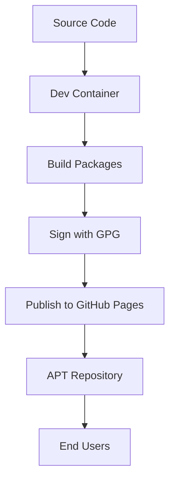

# GH-Repos: GitHub Pages as APT Repositories

Welcome to **GH-Repos**, a powerful solution for creating and managing APT repositories using GitHub Pages with automated package building, signing, and deployment.

## Overview

GH-Repos enables you to:

- 🏗️ **Build** Debian packages in a containerized environment
- 🔐 **Sign** packages with GPG for security and authenticity
- 📦 **Host** APT repositories on GitHub Pages
- 🚀 **Automate** the entire package lifecycle
- 🔄 **Scale** beyond just APT repositories

## Key Features

### Automated Package Management
- Containerized build environment using Dev Containers
- Automated GPG signing with proper key management
- GitHub Actions integration for CI/CD workflows
- Support for multiple package architectures

### Security First
- GPG signing for all packages and repository metadata
- Secure key management with hardware token support
- Cryptographic verification of package integrity
- Trusted package distribution

### Developer Friendly
- Simple workflow: fork, customize, release
- Docker-based development environment
- Cross-platform compatibility (Linux focus)
- Extensive documentation and examples

## Quick Start

1. **[Get Started](usage.md)** - Step-by-step setup guide
2. **[Understand the Design](design.md)** - Architecture overview
3. **[Customize](customize.md)** - Adapt to your needs
4. **[View Releases](releases.md)** - See what's new

## Use Cases

### Personal Package Distribution
Host your own custom Debian packages with professional-grade infrastructure.

### Organization Package Management
Distribute internal tools and libraries to your team or organization.

### Open Source Projects
Provide easy installation for your users through APT repositories.

### Software Vendors
Deliver commercial software with trusted package management.

## Architecture Highlights

The system uses a **Dev Container** approach ensuring consistent builds across different environments while maintaining security through proper user mapping and GPG key management.

## Getting Started

Ready to create your own APT repository? Head over to our **[Getting Started Guide](usage.md)** to begin your journey.

For a deeper understanding of how everything works, check out our **[Design & Architecture](design.md)** documentation.

---

*Built with ❤️ for the open source community*