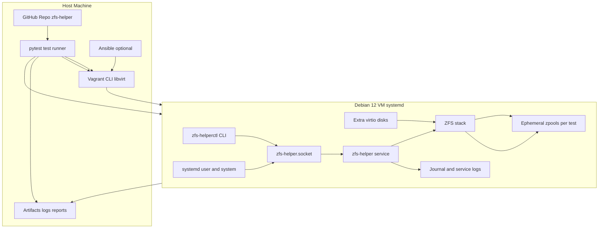
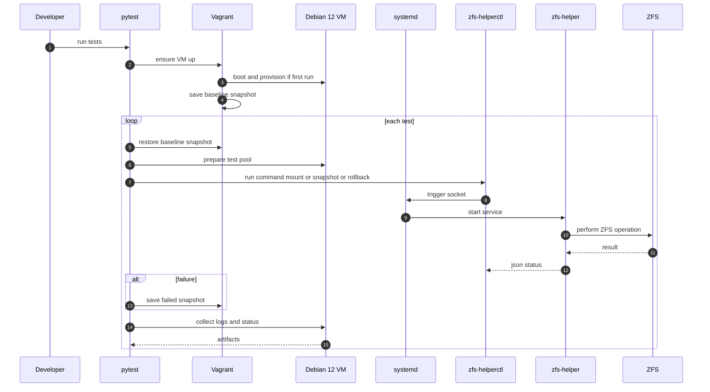

# Testing Framework

>**WIP**: This section is under active development and may change frequently.

ZFS Helper includes a comprehensive automated test harness using `pytest` to run integration tests against a Debian 12 VM provisioned via Vagrant and libvirt. Each test executes ZFS operations through the helper in an isolated ephemeral zpool, verifying correct behavior, policy enforcement, ownership, and logging.

The value of this system lies not just in the code, but in the rigorous testing that ensures correctness and security in real-world scenarios.

## Test Architecture



## Test Lifecycle



## Test Coverage

### Unit Tests

- **Policy parsing**: Validate glob patterns, user matching, dataset resolution
- **Request validation**: JSON parsing, schema validation, input sanitization
- **Action handlers**: Individual operation logic and parameter validation
- **Logging**: Structured output format and decision tracking

### Integration Tests

End-to-end request flows for all supported actions:

#### Core Operations

- `mount` / `unmount` - Dataset mounting and unmounting
- `snapshot` - Snapshot creation with proper naming
- `rollback` - Dataset rollback to snapshots
- `create` / `destroy` - Dataset lifecycle management
- `rename` - Dataset renaming with validation
- `setprop` - Property setting with constraints
- `share` - Dataset sharing (where supported)

#### Security Tests

- **Authorization**: Verify policy enforcement
- **Authentication**: Group membership validation
- **Service origin**: Systemd user service requirement
- **Credential validation**: SO_PEERCRED verification

### Negative Testing

- **Unauthorized units**: Services not in `units.list`
- **Disallowed datasets**: Datasets outside policy scope
- **Invalid arguments**: Malformed commands and parameters
- **Root callers**: Rejection of privileged users
- **Malformed payloads**: Invalid JSON and missing fields

### Ownership Verification

- **Dataset creation**: Correct UID/GID assignment
- **Snapshot creation**: Proper `.zfs/snapshot` ownership
- **Recursive operations**: Ownership inheritance
- **Permission inheritance**: Group and mode preservation

### Logging Validation

- **Decision logging**: All ALLOW/DENY decisions recorded
- **Structured format**: JSON logging with required fields
- **Error tracking**: Exception and failure logging
- **Audit trail**: Complete request/response logging

### Delegation Sync Testing

- **Policy reflection**: `apply-delegation.py` accuracy
- **ZFS delegation**: Native delegation matching policies
- **Dry-run mode**: Preview functionality
- **Error handling**: Unsupported delegation graceful handling

## Running Tests

### Prerequisites

```bash
# Install test dependencies
sudo apt install vagrant libvirt-dev python3-pytest

# Install Python test requirements
pip3 install pytest pytest-asyncio vagrant-python
```

### Test Execution

```bash
# Run all tests
pytest tests/

# Run specific test categories
pytest tests/unit/           # Unit tests only
pytest tests/integration/    # Integration tests only
pytest tests/security/       # Security-focused tests

# Run with coverage
pytest --cov=zfs-helper tests/

# Verbose output with logs
pytest -v -s tests/
```

### VM Management

```bash
# Start test VM
vagrant up

# SSH into test VM
vagrant ssh

# Clean VM state
vagrant destroy -f && vagrant up

# Save VM snapshot
vagrant snapshot save baseline

pytest tests

# Restore VM snapshot
vagrant snapshot restore baseline
```

## Test Environment

### VM Configuration

- **OS**: Debian 12 (bookworm)
- **Memory/vCPU**: 4 GB RAM / 4 vCPUs
- **Storage**: Additional 3 virtio disks for ZFS pools (/dev/vd{b..d})
- **Services**: systemd, ZFS, zfs-helper

### ZFS Test Pools

Each test creates ephemeral zpools:

```bash
# Example test pool creation
zpool create test-pool /dev/vd{b..d}
zfs create test-pool/test-dataset
```

### Policy Test Files

Tests create temporary policy configurations:

```bash
/etc/zfs-helper/policy.d/testuser/
├── units.list
├── mount.list
├── snapshot.list
└── setprop.values.list
```

## Test Categories

### Smoke Tests

Quick validation of basic functionality:

- Service startup and socket creation
- Basic mount/unmount operations
- Simple snapshot creation
- Policy file loading

### Regression Tests

Prevent known issues from reoccurring:

- Previous bug fixes
- Edge case handling
- Error condition recovery
- Performance regressions

### Stress Tests

High-load and concurrent scenarios:

- Multiple simultaneous requests
- Large dataset operations
- Memory usage validation
- Socket connection limits

### Security Tests II

Comprehensive security validation:

- Privilege escalation attempts
- Policy bypass attempts
- Input injection testing
- Authentication bypass testing


## Contributing Tests

### Adding New Tests

1. Create test files in appropriate directories
2. Follow naming convention: `test_*.py`
3. Use descriptive test names: `test_mount_with_valid_policy`
4. Include both positive and negative test cases
5. Add appropriate fixtures and cleanup

### Test Standards

- **Isolation**: Each test should be independent
- **Cleanup**: Restore system state after tests
- **Documentation**: Clear test descriptions and comments
- **Coverage**: Aim for high code coverage
- **Performance**: Tests should complete reasonably quickly

### Mock Usage

For unit tests, mock external dependencies:

```python
@patch('subprocess.run')
def test_zfs_command_execution(mock_run):
    mock_run.return_value.returncode = 0
    # Test logic here
```

This comprehensive testing framework ensures ZFS Helper maintains high quality, security, and reliability across all supported use cases and environments.
